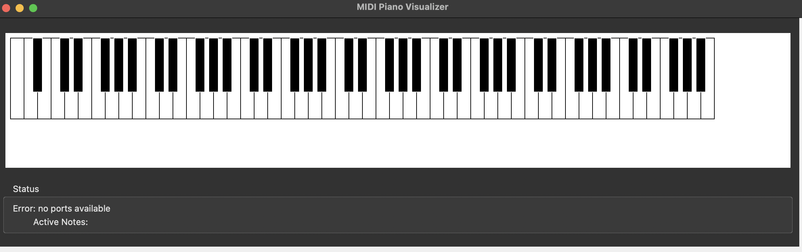

# Piano-Detect-MIDI

Piano detects key presses, connected via MIDI port, displayed on GUI



# Install Dependency

```

pyenv install 3.9.16  # or any desired version
pyenv virtualenv 3.9.16 piano-env
pyenv activate piano-env

```

Python

```
pip install mido python-rtmidi
python3 -m tkinter
echo 'export PATH="/opt/homebrew/opt/tcl-tk/bin:$PATH"' >> ~/.bash_profile
echo 'export LDFLAGS="-L/opt/homebrew/opt/tcl-tk/lib"' >> ~/.bash_profile
echo 'export CPPFLAGS="-I/opt/homebrew/opt/tcl-tk/include"' >> ~/.bash_profile
source ~/.bash_profile

Linux
sudo apt install python3-tk

Mac
brew install tcl-tk
```

1- Check Midi Connector
`python detect_piano_midi.py`

2- Run main App and check Key Pressed
`python main.py`
